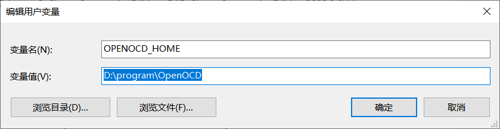
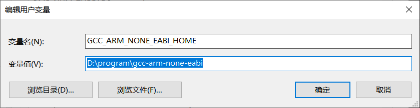

# 环境配置

## 安装

### MinGW

下载：[MinGW](https://sourceforge.net/projects/mingw/)

### OpenOCD

下载：[OpenOCD](https://github.com/xpack-dev-tools/openocd-xpack) / [OpenOCD for Windows](https://gnutoolchains.com/arm-eabi/openocd/)/[OpenOCD release](https://github.com/xpack-dev-tools/openocd-xpack/releases/tag/v0.12.0-1)

解压后，设置用户环境变量 `OPENOCD_HOME` 为解压目录路径，并且在用户环境变量path中添加 `%OPENOCD_HOME%\bin` ,打开终端输入 openocd 检查环境变量是否配置成功

设置环境变量如下

### arm-none-eabi-gcc

下载 [arm-none-eabi-gcc](https://developer.arm.com/downloads/-/gnu-rm) 

解压后，设置用户环境变量 `GCC_ARM_NONE_EABI_HOME` 并且在用户环境变量path中添加 `%GCC_ARM_NONE_EABI_HOME%\bin` ,打开终端输入g++执行bin文件里面的可执行文件 检查环境变量是否配置成功

设置环境变量如下

### CMAKE

下载：[cmake](https://cmake.org/download/)

解压后，设置用户环境变量 `CMAKE_HOME` 并且在用户环境变量path中添加 `%CMAKE_HOME%\bin` ,打开终端输入g++执行bin文件里面的可执行文件 检查环境变量是否配置成功

设置环境变量如下

windows 下存在 make can not found 的问题 需要把MinGW当中的 mingw32-make.exe 文件复制粘贴。将粘贴的文件修改成 make 才可以找到路径

